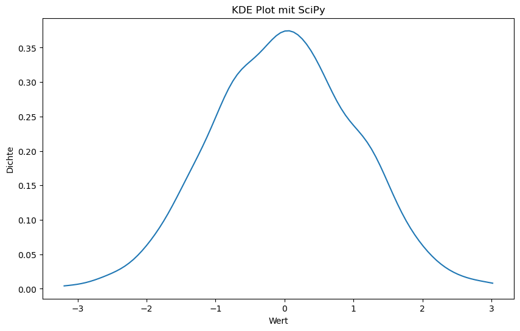

# Notebook

Der Python-Code umfasst eine Vielzahl an Bibliotheken, wie NumPy, Pandas, Matplotlib, Seaborn, SciPy, Scikit-learn, PyTorch, Pygame, Requests und SQLAlchemy. Der Fokus liegt auf Datenanalyse, maschinellem Lernen, Grafikdarstellung und Datenbankoperationen. 

Die Verbesserungen betreffen mehrere Aspekte. Zunächst wurde eine umfassende **Dokumentation** durch Docstrings und Kommentare hinzugefügt, um die Verständlichkeit des Codes zu erhöhen. Zudem wurde eine **Fehlerbehandlung** implementiert, um potenzielle Fehler in den verschiedenen Funktionen abzufangen und zu protokollieren, insbesondere bei HTTP-Anfragen und Datenbankoperationen. 

Zur **Modularisierung** wurden SQLAlchemy-Modelle definiert und die Funktionen logisch getrennt, um die Wiederverwendbarkeit zu fördern. Außerdem wurden **Performance-Optimierungen** bei der Visualisierung großer Datenmengen in der `pandas_seaborn_example`-Funktion vorgenommen, um die Effizienz zu verbessern.

Die **Benutzerinteraktion** in Pygame wurde erweitert, sodass das Programm nun auf Benutzeraktionen wie das Schließen des Fensters reagiert. Schließlich wurde ein **Logging-System** eingerichtet, das wichtige Informationen, Warnungen und Fehler protokolliert, um die Debugging-Fähigkeiten zu verbessern.


```python
import numpy as np
import pandas as pd
import matplotlib.pyplot as plt
import seaborn as sns
from ipywidgets import interact, widgets
from scipy import stats
from sklearn.datasets import load_iris
from sklearn.model_selection import train_test_split
from sklearn.linear_model import LogisticRegression
import torch
import pygame
import requests
from sqlalchemy import create_engine, Column, Integer, String
from sqlalchemy.orm import declarative_base, sessionmaker
import logging

# Einrichtung des Loggings
logging.basicConfig(level=logging.INFO, format='%(levelname)s: %(message)s')

# SQLAlchemy-Basis-Klasse
Base = declarative_base()

class User(Base):
    """
    Modellklasse für Benutzer in der Datenbank.
    """
    __tablename__ = 'users'
    id = Column(Integer, primary_key=True)
    name = Column(String)

def numpy_example(size=5):
    """
    Generiert ein zufälliges NumPy-Array und berechnet Mittelwert sowie Standardabweichung.
    
    Parameters:
    size (int): Größe des Arrays.
    """
    try:
        array = np.random.rand(size)
        print('NumPy Array:', array)
        print('Mittelwert:', np.mean(array))
        print('Standardabweichung:', np.std(array))
    except Exception as e:
        logging.error(f"Fehler in numpy_example: {e}")

interact(numpy_example, size=widgets.IntSlider(min=1, max=10, step=1, value=5))

def pandas_seaborn_example(rows=50):
    """
    Erstellt einen Pandas DataFrame und visualisiert ihn mit Seaborn.
    
    Parameters:
    rows (int): Anzahl der Zeilen im DataFrame.
    """
    try:
        # Performance-Optimierung: Begrenzung der maximalen Zeilen
        max_rows = 200
        if rows > max_rows:
            logging.warning(f"Angeforderte Zeilenanzahl überschreitet das Maximum von {max_rows}. Begrenze auf {max_rows}.")
            rows = max_rows
        
        df = pd.DataFrame({
            'A': np.random.randn(rows),
            'B': np.random.randn(rows),
            'C': np.random.choice(['Gruppe1', 'Gruppe2', 'Gruppe3'], rows)
        })
        print('Pandas DataFrame (erste 5 Zeilen):')
        print(df.head())
        
        plt.figure(figsize=(10, 6))
        sns.scatterplot(data=df, x='A', y='B', hue='C')
        plt.title('Seaborn Scatterplot')
        plt.show()
    except Exception as e:
        logging.error(f"Fehler in pandas_seaborn_example: {e}")

interact(pandas_seaborn_example, rows=widgets.IntSlider(min=10, max=200, step=10, value=50))

def plot_example(func_type='linear'):
    """
    Plottet eine mathematische Funktion basierend auf dem ausgewählten Typ.
    
    Parameters:
    func_type (str): Typ der Funktion ('linear', 'quadratic', 'cubic').
    """
    try:
        x = np.linspace(0, 10, 100)
        
        if func_type == 'linear':
            y = x
            title = 'Lineare Funktion'
        elif func_type == 'quadratic':
            y = x**2
            title = 'Quadratische Funktion'
        elif func_type == 'cubic':
            y = x**3
            title = 'Kubische Funktion'
        else:
            raise ValueError("Ungültiger Funktionstyp")
        
        plt.figure(figsize=(10, 6))
        plt.plot(x, y)
        plt.title(title)
        plt.xlabel('x')
        plt.ylabel('y')
        plt.grid(True)
        plt.show()
        print(f"Plot für {title} wurde erstellt.")
    except Exception as e:
        logging.error(f"Fehler in plot_example: {e}")

interact(plot_example, func_type=widgets.Dropdown(
    options=['linear', 'quadratic', 'cubic'],
    value='linear',
    description='Funktionstyp:'
))

def scipy_example():
    """
    Erzeugt einen Kernel-Dichte-Schätzer (KDE) Plot mit SciPy.
    """
    try:
        x = np.random.normal(0, 1, 1000)
        kde = stats.gaussian_kde(x)
        x_range = np.linspace(min(x), max(x), 100)
        plt.figure(figsize=(10, 6))
        plt.plot(x_range, kde(x_range))
        plt.title('KDE Plot mit SciPy')
        plt.xlabel('Wert')
        plt.ylabel('Dichte')
        plt.show()
    except Exception as e:
        logging.error(f"Fehler in scipy_example: {e}")

scipy_example()

def sklearn_example():
    """
    Führt eine logistische Regression auf dem Iris-Datensatz durch und bewertet die Genauigkeit.
    """
    try:
        iris = load_iris()
        X_train, X_test, y_train, y_test = train_test_split(iris.data, iris.target, test_size=0.3, random_state=42)
        model = LogisticRegression(max_iter=200)
        model.fit(X_train, y_train)
        accuracy = model.score(X_test, y_test)
        print(f"Genauigkeit des Modells: {accuracy:.2f}")
    except Exception as e:
        logging.error(f"Fehler in sklearn_example: {e}")

sklearn_example()

def pytorch_example():
    """
    Demonstriert die Erstellung und Berechnung von PyTorch-Tensoren.
    """
    try:
        x = torch.randn(5, 3)
        print("PyTorch Tensor:")
        print(x)
        print("Summe:", x.sum())
        print("Mittelwert:", x.mean())
    except Exception as e:
        logging.error(f"Fehler in pytorch_example: {e}")

pytorch_example()

def pygame_example():
    """
    Erstellt ein Pygame-Fenster, in dem ein roter Kreis gezeichnet wird. Ermöglicht Benutzerinteraktionen zum Beenden des Fensters.
    """
    try:
        pygame.init()
        screen = pygame.display.set_mode((300, 200))
        pygame.display.set_caption('Pygame Beispiel')
        clock = pygame.time.Clock()
        running = True

        while running:
            for event in pygame.event.get():
                if event.type == pygame.QUIT:
                    running = False
                elif event.type == pygame.KEYDOWN:
                    if event.key == pygame.K_ESCAPE:
                        running = False

            screen.fill((255, 255, 255))
            pygame.draw.circle(screen, (255, 0, 0), (150, 100), 30)
            pygame.display.flip()
            clock.tick(60)  # Begrenzung auf 60 FPS

        pygame.quit()
        print("Pygame: Das Fenster wurde geschlossen.")
    except Exception as e:
        logging.error(f"Fehler in pygame_example: {e}")

pygame_example()

def requests_example():
    """
    Führt eine HTTP-Anfrage an die GitHub-API durch und gibt den Statuscode sowie die Header-Informationen aus.
    """
    try:
        response = requests.get('https://api.github.com', timeout=10)
        response.raise_for_status()  # Prüft auf HTTP-Fehler
        print(f"GitHub API Status: {response.status_code}")
        print("Headers:")
        for key, value in response.headers.items():
            print(f"{key}: {value}")
    except requests.exceptions.HTTPError as http_err:
        logging.error(f"HTTP-Fehler: {http_err}")
    except requests.exceptions.ConnectionError as conn_err:
        logging.error(f"Verbindungsfehler: {conn_err}")
    except requests.exceptions.Timeout as timeout_err:
        logging.error(f"Timeout-Fehler: {timeout_err}")
    except requests.exceptions.RequestException as req_err:
        logging.error(f"Allgemeiner Fehler bei der HTTP-Anfrage: {req_err}")

requests_example()

def sqlalchemy_example():
    """
    Demonstriert die Erstellung einer In-Memory-Datenbank mit SQLAlchemy, das Hinzufügen eines Benutzers und die Abfrage der Datensätze.
    """
    try:
        engine = create_engine('sqlite:///:memory:', echo=False)
        Base.metadata.create_all(engine)
        
        Session = sessionmaker(bind=engine)
        session = Session()
        
        # Hinzufügen eines neuen Benutzers
        new_user = User(name='John Doe')
        session.add(new_user)
        session.commit()
        logging.info("Neuer Benutzer hinzugefügt.")
        
        # Abfrage aller Benutzer
        users = session.query(User).all()
        for user in users:
            print(f"User ID: {user.id}, Name: {user.name}")
        
        session.close()
    except Exception as e:
        logging.error(f"Fehler in sqlalchemy_example: {e}")

sqlalchemy_example()

```

    pygame 2.6.0 (SDL 2.30.7, Python 3.12.6)
    Hello from the pygame community. https://www.pygame.org/contribute.html


    interactive(children=(IntSlider(value=5, description='size', max=10, min=1), Output()), _dom_classes=('widget-…


    interactive(children=(IntSlider(value=50, description='rows', max=200, min=10, step=10), Output()), _dom_class…


    interactive(children=(Dropdown(description='Funktionstyp:', options=('linear', 'quadratic', 'cubic'), value='l…


    

    


    Genauigkeit des Modells: 1.00
    PyTorch Tensor:
    tensor([[ 0.8768,  1.6091, -1.2619],
            [-1.2175,  0.4161, -0.0572],
            [-1.2709, -0.6149,  1.0070],
            [ 1.6220,  0.2057,  0.1930],
            [-0.1122, -0.9012,  0.6234]])
    Summe: tensor(1.1173)
    Mittelwert: tensor(0.0745)


    INFO: Neuer Benutzer hinzugefügt.


    Pygame: Das Fenster wurde geschlossen.
    GitHub API Status: 200
    Headers:
    Date: Sat, 28 Sep 2024 21:15:02 GMT
    Content-Type: application/json; charset=utf-8
    Cache-Control: public, max-age=60, s-maxage=60
    Vary: Accept,Accept-Encoding, Accept, X-Requested-With
    ETag: W/"4f825cc84e1c733059d46e76e6df9db557ae5254f9625dfe8e1b09499c449438"
    X-GitHub-Media-Type: github.v3; format=json
    x-github-api-version-selected: 2022-11-28
    Access-Control-Expose-Headers: ETag, Link, Location, Retry-After, X-GitHub-OTP, X-RateLimit-Limit, X-RateLimit-Remaining, X-RateLimit-Used, X-RateLimit-Resource, X-RateLimit-Reset, X-OAuth-Scopes, X-Accepted-OAuth-Scopes, X-Poll-Interval, X-GitHub-Media-Type, X-GitHub-SSO, X-GitHub-Request-Id, Deprecation, Sunset
    Access-Control-Allow-Origin: *
    Strict-Transport-Security: max-age=31536000; includeSubdomains; preload
    X-Frame-Options: deny
    X-Content-Type-Options: nosniff
    X-XSS-Protection: 0
    Referrer-Policy: origin-when-cross-origin, strict-origin-when-cross-origin
    Content-Security-Policy: default-src 'none'
    Content-Encoding: gzip
    Server: github.com
    X-RateLimit-Limit: 60
    X-RateLimit-Remaining: 59
    X-RateLimit-Reset: 1727561718
    X-RateLimit-Resource: core
    X-RateLimit-Used: 1
    Accept-Ranges: bytes
    Content-Length: 510
    X-GitHub-Request-Id: 9AF0:3DC24D:1328D58:136FC58:66F871E6
    User ID: 1, Name: John Doe


```python

```
